# 🦾 5-DOF Robot Arm Planner & Autonomous Sorting System

A full-stack robotics project combining a browser-based kinematic simulation with real ESP32 embedded firmware for autonomous object sorting using dual sensors.

---
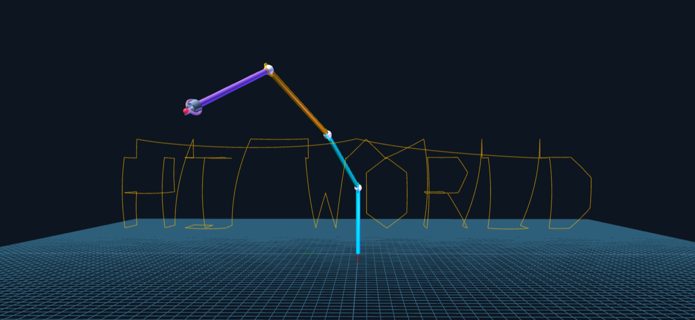
## Table of Contents

- [Overview](#overview)
- [Features](#features)
- [System Architecture](#system-architecture)
- [Hardware Requirements](#hardware-requirements)
- [Software Requirements](#software-requirements)
- [Wiring & Pinout](#wiring--pinout)
- [Getting Started](#getting-started)
  - [1. Flash the ESP32 Firmware](#1-flash-the-esp32-firmware)
  - [2. Open the Simulation Planner](#2-open-the-simulation-planner)
  - [3. Connect to Your ESP32](#3-connect-to-your-esp32)
  - [4. Configure Servo Parameters](#4-configure-servo-parameters)
  - [5. Plan & Execute Motion Paths](#5-plan--execute-motion-paths)
  - [6. Configure Sensor Sorting](#6-configure-sensor-sorting)
- [Kinematics Reference](#kinematics-reference)
  - [DH Parameters](#dh-parameters)
  - [Forward Kinematics](#forward-kinematics)
  - [Inverse Kinematics](#inverse-kinematics)
- [REST API Reference (ESP32)](#rest-api-reference-esp32)
- [JSON Path Format](#json-path-format)
- [Sorting Logic](#sorting-logic)
- [Sensor Calibration](#sensor-calibration)
- [Troubleshooting](#troubleshooting)
- [File Structure](#file-structure)

---

## Overview

This project provides a complete pipeline for programming, simulating, and physically operating a 5-DOF (Degree of Freedom) robotic arm with an integrated sensor-based sorting system. The simulation runs entirely in the browser — no installation or build step required. The firmware runs on an ESP32 and communicates with the browser interface over your local Wi-Fi network.

**Core capabilities:**

- Plan and visualize multi-waypoint motion paths in 3D
- Solve inverse kinematics to reach Cartesian target positions
- Upload paths to ESP32 and execute them on real hardware
- Autonomously sort metal vs. non-metal objects using ultrasonic and inductive sensors
- Live-stream pose changes from the browser directly to the robot

---

## Features
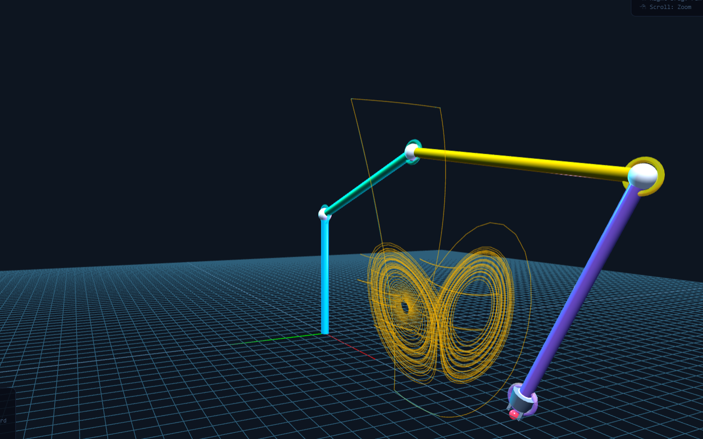


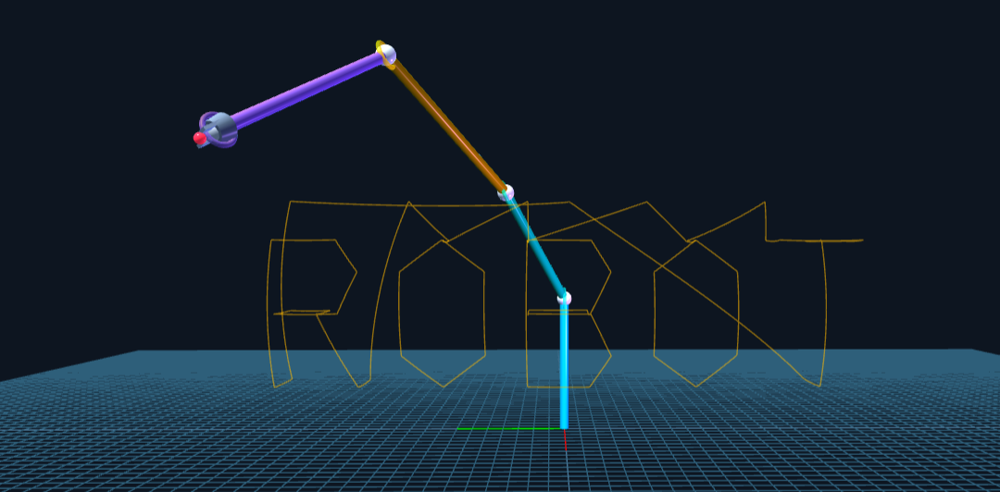

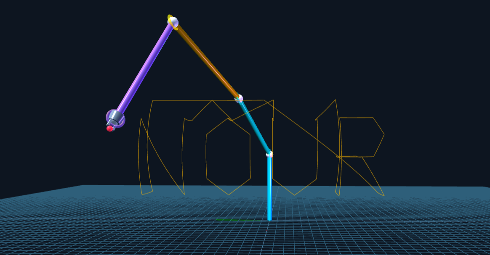

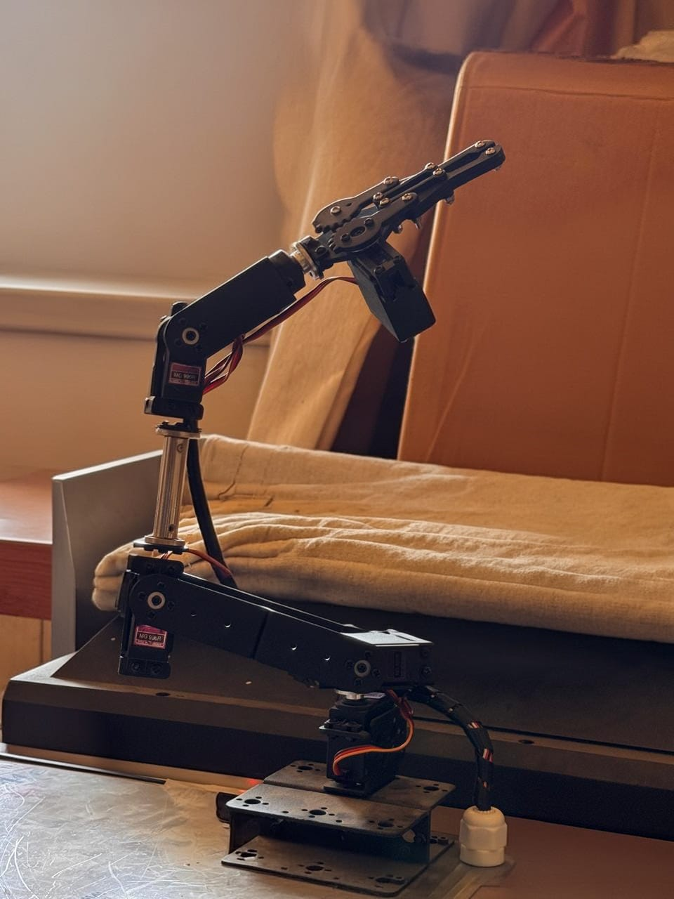

### Browser Simulation (`robot_arm_planner_sorting.html`)

| Tab | Capability |
|---|---|
| **DH** | Edit Denavit-Hartenberg parameters per link (d, a, α) |
| **FK** | Control all 6 joints manually with live 3D arm update |
| **IK** | Enter an XYZ target; numerical solver finds joint angles |
| **PATH** | Build waypoint sequences, animate playback, import/export JSON |
| **SENSOR** | Configure dual-sensor sorting paths and monitor sensor state |
| **MCU** | Wi-Fi/PCA9685 config, live sync, path upload, code generation |

**3D Viewport controls:**

| Action | Control |
|---|---|
| Orbit | Left mouse drag |
| Pan | Right mouse drag |
| Zoom | Scroll wheel |
| Preset views | FRONT / SIDE / TOP / HOME buttons |

### Embedded Firmware (`robot_arm_esp32_sorting.ino`)

- 6-axis servo control via PCA9685 over I²C
- Smoothstep-interpolated joint motion (pulse-level resolution)
- HTTP REST API with CORS
- Embedded web interface served from PROGMEM (no SD card needed)
- Autonomous sensor-driven sorting with dual independent paths
- Serial debug output at 115200 baud

---

## Simulation Tabs Explained

The browser planner (`robot_arm_planner_sorting.html`) is organized into six tabs. Each tab controls a different aspect of the robot arm.

### DH — Denavit-Hartenberg Parameters

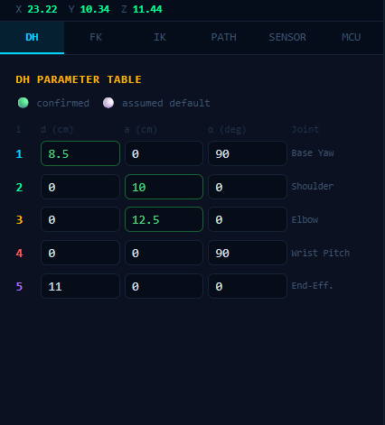

This tab displays and edits the kinematic model of the arm.

| Column | Meaning | What to change |
|---|---|---|
| **d** | Link offset along previous Z axis (cm) | Measure the vertical distance between joint axes |
| **a** | Link length — distance between Z axes (cm) | Measure the horizontal distance between joints |
| **α** | Twist angle between Z axes (degrees) | Usually 0° or 90° based on joint orientation |

**How to use:**
- Green-bordered cells indicate confirmed physical measurements.
- Edit any value and the 3D arm updates instantly.
- These parameters define how the FK and IK solvers calculate positions.
- If your physical arm has different link lengths, measure them and update here before using IK.

**Tip:** The default values (d=8.5, a=10, a=12.5, d=11) match a typical 5-DOF desktop arm. If your arm is bigger or smaller, scale all `a` and `d` values proportionally.

---

### FK — Forward Kinematics

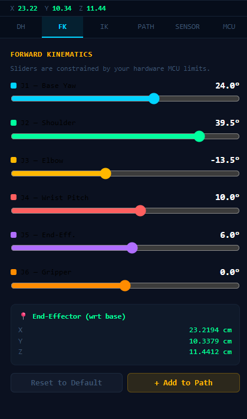

This tab gives you direct joint control with live 3D visualization.

**What you see:**
- Six sliders (J1–J6), each constrained by the hardware limits you set in **MCU → Setup**.
- Real-time end-effector position (X, Y, Z) in centimetres.
- The 3D model updates instantly as you drag sliders.

**How to use:**
- Drag any slider to move that joint.
- J1 (Base Yaw) rotates the entire arm left/right.
- J2 (Shoulder) and J3 (Elbow) control the main arm reach.
- J4 (Wrist Pitch) angles the wrist up/down.
- J5 (Wrist Roll) rotates the wrist.
- J6 (Gripper) opens/closes the gripper fingers.
- Click **Reset to Default** to return to the home pose `[0, 60, -120, 60, 0, 0]`.
- Click **+ Add to Path** to save the current pose as a waypoint.

**Tip:** The gripper (J6) does not affect the end-effector position in the FK calculation — it only controls the fingers. This is correct because opening/closing a gripper doesn't move the arm's tip.

---

### IK — Inverse Kinematics

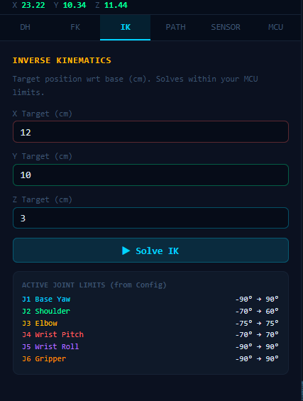
 
This tab lets you specify a target position in space, and the solver finds the joint angles to reach it.

**What you see:**
- Three input fields: **X Target**, **Y Target**, **Z Target** (in cm, relative to base).
- A **Solve IK** button that runs the numerical solver.
- Active joint limits from your servo configuration.

**How to use:**
1. Enter a target position, e.g. `X=15`, `Y=0`, `Z=9`.
2. Click **▶ Solve IK**.
3. The solver runs up to 600 iterations. If it converges, you see:
   - **✅ Converged** — error < 0.5 cm
   - **⚠ Approximate** — error > 0.5 cm (target may be near workspace edge)
4. Review the solved angles for each joint.
5. Click **Apply to Arm →** to move the simulation to that pose.
6. From the **FK** tab, click **+ Add to Path** to save it.

**How the solver works:**
- Uses Jacobian-based damped least squares (`λ = 0.5`).
- Perturbs each joint by `ε = 0.4°` to build the Jacobian numerically.
- Clamps every update to your hardware joint limits.
- Stops when position error is < 0.04 cm or max iterations reached.

**Tip:** If IK fails repeatedly, check that your target is within reach. The workspace is roughly a hemisphere in front of the base with radius ~30 cm. Also verify your DH parameters match your physical arm.

---

### PATH — Path Planning

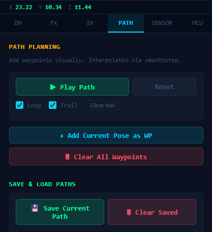

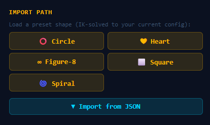

This tab is where you build, preview, and manage multi-waypoint motion sequences.

**What you see:**
- Playback controls: **▶ Play Path**, **⏹ Stop**, **Reset**.
- Loop and Trail checkboxes.
- A list of all waypoints with drag-to-reorder, edit labels, adjust speed.
- Import/Export JSON, preset shapes, and saved path management.

**How to build a path:**
1. Use **FK** or **IK** to position the arm.
2. Click **+ Add Current Pose as WP** (or the **+ Add to Path** button in FK).
3. Repeat for each position you want in the sequence.
4. Click **▶ Play Path** to animate the 3D model through all waypoints.
5. Adjust each waypoint's speed with the slider (0.1× to 5×).
6. Enable **Loop** to make the path repeat continuously.
7. Enable **Trail** to see the end-effector trajectory drawn in 3D.

**Waypoint controls:**
| Button | Action |
|---|---|
| ↑ / ↓ | Reorder waypoint |
| ▶ | Load this waypoint's angles into the simulation |
| ↺ | Update this waypoint to the current simulation pose |
| × | Delete waypoint |

**Presets (auto-solved):**
- **⭕ Circle**, **❤ Heart**, **∞ Figure-8**, **⬜ Square**, **🌀 Spiral**
- Click any preset to auto-generate a cartesian path, solve IK for each point, and add to your path.

**Import / Export:**
- Paste a JSON path (angles or cartesian) into the **Import from JSON** textarea and click **Import**.
- Click **Export Current Path as JSON** to copy your path as JSON to the clipboard.

**Save & Load:**
- Click **💾 Save Current Path** to store the path in your browser's LocalStorage.
- Saved paths persist across page reloads.
- Click **▶ Load** to restore a saved path, **↺ Save** to overwrite, **×** to delete.

---

### SENSOR — Sensor Sorting System

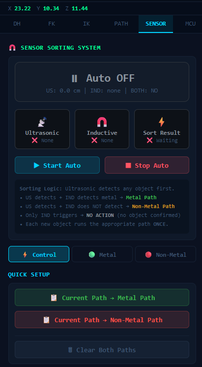

This tab configures and monitors the autonomous sorting behavior.

**What you see:**
- Live sensor status: Ultrasonic distance, Inductive metal detection, combined result.
- Color-coded status box showing the current automation state.
- Three sub-tabs: **Control**, **Metal**, **Non-Metal**.

**How it works:**
1. The ultrasonic sensor detects any object within range (17–19 cm).
2. The inductive sensor checks if the object is metal.
3. Based on the combination, one of two paths executes:
   - **US + IND** → Metal path
   - **US only** → Non-metal path
   - **IND only** → No action (no object confirmed)

**Quick Setup:**
1. Build a path in the **PATH** tab for metal objects.
2. Click **📋 Current Path → Metal Path** in the SENSOR **Control** tab.
3. Build a different path for non-metal objects.
4. Click **📋 Current Path → Non-Metal Path**.
5. Click **▶ Start Auto** — paths are uploaded to ESP32 and automation begins.

**Sub-tabs:**

| Tab | Purpose |
|---|---|
| **⚡ Control** | Quick setup buttons, system status, sensor logic explanation |
| **🟢 Metal** | Edit the metal-object path directly (add poses, reorder, clear) |
| **🔴 Non-Metal** | Edit the non-metal path directly |

**Monitoring:**
- The status box updates every 400 ms by polling `/sensor_full_status` from the ESP32.
- **🟢 Green** = Metal detected, running metal path
- **🟡 Yellow** = Non-metal detected, running non-metal path
- **🔵 Blue** = Waiting for object
- **⚪ Gray** = Automation off

**Tip:** Each object triggers exactly once thanks to rising-edge detection. The ultrasonic sensor is the primary gate — the inductive sensor alone cannot trigger a path.

---

### MCU — Microcontroller Configuration

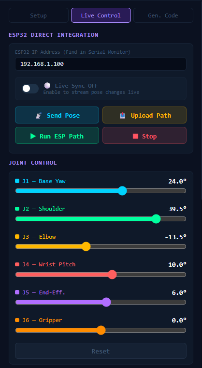

This tab connects the simulation to your physical ESP32 and generates firmware code.

**Sub-tabs:**

#### Setup
Configure hardware parameters:
- **Wi-Fi SSID / Password** — credentials for the ESP32 to connect to your network.
- **Servo Configuration** — per-joint settings:
  - **PCA Channel** (0–15)
  - **Reversed** (invert direction)
  - **Zero Point** (servo angle at kinematic 0°)
  - **Min / Max** (physical travel limits)
  - **Trim** (calibration offset)

**Important:** These limits are enforced in both the simulation sliders and the ESP32 firmware. Setting wrong limits can damage servos or the arm structure.

#### Live Control
Direct ESP32 integration:
- **ESP32 IP Address** — enter the IP from Serial Monitor.
- **🔴 Live Sync** toggle — when ON, every slider movement in FK is sent to the robot in real time (80 ms debounce).
- **📡 Send Pose** — one-shot send of current simulation angles to ESP32.
- **📤 Upload Path** — sends all waypoints to ESP32's path buffer.
- **▶ Run ESP Path** — tells ESP32 to start executing its stored path.
- **⏹ Stop** — stops motion immediately.
- **🔄 Sync from Robot** — reads the ESP32's current joint angles and updates the simulation (useful after sensor automation runs).
- **Embedded Interface** — loads the ESP32's own web UI in an iframe.

**Workflow:**
1. Enter ESP32 IP.
2. Enable **Live Sync** to stream changes.
3. Or use **Send Pose** for discrete moves.
4. Upload paths, then run them on the ESP32.

#### Gen. Code
Generates a complete Arduino sketch based on your current configuration:
- Includes all servo parameters, waypoints, and Wi-Fi credentials.
- Click **📋 Copy to Clipboard** to paste into Arduino IDE.
- Upload this code once, then use the Live Control tab for all dynamic updates.

**Tip:** You only need to generate and upload code once. After that, use the HTTP endpoints (`/set`, `/set_all`, `/add_wp`) to update paths and poses dynamically without reflashing.

---

## System Architecture

```
┌─────────────────────────────────┐        Wi-Fi (HTTP REST)
│   Browser Planner               │◄──────────────────────────►│ ESP32           │
│   robot_arm_planner_sorting.html│                             │                 │
│                                 │                             │ PCA9685 ────── Servos (J1-J6)
│  ┌───────┐  ┌────────────────┐  │                             │ GPIO34 ─────── Inductive Sensor
│  │ Three │  │ React 18 UI   │  │                             │ GPIO18 ─────── Ultrasonic TRIG
│  │  .js  │  │ (FK/IK/Path)  │  │                             │ GPIO19 ─────── Ultrasonic ECHO
│  └───────┘  └────────────────┘  │                             │ GPIO21/22 ──── I²C (SDA/SCL)
└─────────────────────────────────┘
```

---

## Hardware Requirements

| Component | Model / Spec | Notes |
|---|---|---|
| Microcontroller | ESP32 (any 38-pin variant) | Tested on ESP32-WROOM-32 |
| PWM Driver | PCA9685 16-channel, I²C | Address `0x40` default |
| Servos | Standard PWM 5V servos × 6 | Channels 0–5 |
| Ultrasonic Sensor | HC-SR04 | 5V, needs logic level if using 3.3V GPIOs |
| Inductive Sensor | LJ12A3-4-Z/BX (NPN, NO) | 6-36V supply; output pulled to GPIO via resistor |
| Power Supply | 5V / ≥3A | Servos draw significant current; do NOT power from USB alone |
| Breadboard + wiring | — | Decoupling caps (100µF) on servo power rails recommended |

---

## Software Requirements

**For flashing the firmware:**

- [Arduino IDE 2.x](https://www.arduino.cc/en/software) or PlatformIO
- ESP32 board support package: add `https://dl.espressif.com/dl/package_esp32_index.json` to Arduino Board Manager URLs
- Libraries (install via Library Manager):
  - `Adafruit PWM Servo Driver Library` (by Adafruit)
  - `WiFi` and `WebServer` (bundled with ESP32 board package)

**For the browser planner:**

- Any modern browser (Chrome, Firefox, Edge)
- No build step — open the `.html` file directly or serve it via any static file server

---

## Wiring & Pinout

### ESP32 → PCA9685 (I²C)

| ESP32 Pin | PCA9685 Pin |
|---|---|
| GPIO 21 | SDA |
| GPIO 22 | SCL |
| 3.3V | VCC |
| GND | GND |

> Connect servo power (V+) to an external 5V rail, NOT the ESP32 3.3V. Connect servo GND to the same ground as ESP32.

### Servo Channels (PCA9685)

| Channel | Joint | Label |
|---|---|---|
| 0 | J1 | Base Yaw |
| 1 | J2 | Shoulder |
| 2 | J3 | Elbow |
| 3 | J4 | Wrist Pitch |
| 4 | J5 | Wrist Roll |
| 5 | J6 | Gripper |

### Sensor Wiring

**HC-SR04 Ultrasonic:**

| HC-SR04 Pin | ESP32 Pin |
|---|---|
| VCC | 5V |
| GND | GND |
| TRIG | GPIO 18 |
| ECHO | GPIO 19 (use a 1kΩ/2kΩ voltage divider if your ESP32 is not 5V tolerant on this pin) |

**LJ12A3-4-Z/BX Inductive (NPN NO):**

| Inductive Pin | Connection |
|---|---|
| Brown | 12–24V supply |
| Blue | GND |
| Black (output) | GPIO 34 (INPUT_PULLUP enabled in firmware) |

> The NPN NO output pulls LOW when metal is detected. The firmware reads `LOW` as metal detected.

---

## Getting Started

### 1. Flash the ESP32 Firmware

1. Open `robot_arm_esp32_sorting.ino` in Arduino IDE.
2. Edit the Wi-Fi credentials at the top of the file:

```cpp
const char* ssid     = "YOUR_WIFI_SSID";
const char* password = "YOUR_WIFI_PASSWORD";
```

3. Adjust sensor distance range if needed:

```cpp
#define ULTRASONIC_MIN_CM  17   // Minimum detection distance (cm)
#define ULTRASONIC_MAX_CM  19   // Maximum detection distance (cm)
```

4. Select your board: **Tools → Board → ESP32 Dev Module**
5. Select the correct COM port.
6. Upload. Open Serial Monitor at **115200 baud** to see the assigned IP address, e.g.:

```
WiFi Connected! IP: 192.168.1.105
HTTP server started.
```

7. Note this IP address — you will need it in the browser planner.

---

### 2. Open the Simulation Planner

Open `robot_arm_planner_sorting.html` in any modern browser. No installation required — it loads React and Three.js from CDN.

The planner works fully offline for simulation. It only needs network access to your ESP32 when you use the live sync or path upload features.

---

### 3. Connect to Your ESP32

1. Click the **MCU** tab in the planner.
2. Select the **Live Control** sub-tab.
3. Enter your ESP32's IP address in the field (e.g. `192.168.1.105`).
4. Click **Send Pose** to test the connection — the arm should move to the current simulated position.

If the embedded ESP32 web interface appears at the bottom of the Live Control panel, the connection is working.

---

### 4. Configure Servo Parameters

In the **MCU → Setup** sub-tab, configure each joint:

| Parameter | Description |
|---|---|
| PCA Channel | Which PCA9685 output (0–15) drives this joint |
| Reversed | Inverts the servo direction for mechanical mirroring |
| Zero Point | Physical servo angle (degrees) corresponding to 0° kinematic angle |
| Min / Max | Physical servo travel limits (degrees) — prevents mechanical damage |
| Trim | Fine offset for calibration (degrees) |

The **FK** and **IK** tabs automatically constrain joint angles to the limits you set here.

---

### 5. Plan & Execute Motion Paths

**Manual waypoint path:**

1. Use the **FK** tab sliders to position the arm.
2. Click **+ Add to Path** or use the **PATH** tab → **+ Add Current Pose as WP**.
3. Repeat for each waypoint.
4. Click **▶ Play Path** to simulate the motion in the browser.
5. In **MCU → Live Control**, click **Upload Path** to send all waypoints to ESP32, then **▶ Run ESP Path** to execute on hardware.

**Preset shapes (IK auto-solved):**

In the **PATH** tab, click any preset button (Circle, Heart, Figure-8, Square, Spiral). The planner will auto-solve IK for each point and add them to your path.

**JSON import:**

In the **PATH** tab → **Import from JSON**, paste a JSON path object (see [JSON Path Format](#json-path-format)) and click **Import**.

**Export current path:**

Click **Export Current Path as JSON** to get a JSON blob of all waypoints you can save and reuse.

---

### 6. Configure Sensor Sorting

1. Click the **SENSOR** tab.
2. Under **⚡ Control**, click **Current Path → Metal Path** to assign the active waypoint path as the metal object response.
3. Build a different waypoint sequence for non-metal objects and click **Current Path → Non-Metal Path**.
4. Both paths need at least 2 waypoints each.
5. In **MCU → Live Control**, click **Upload Path** (this also uploads sensor paths).
6. Click **▶ Start Auto** in the SENSOR tab.

The arm will now automatically detect and sort objects. Each object triggers the correct path exactly once (rising-edge detection).

---

## Kinematics Reference

### DH Parameters

The arm uses the classic Denavit-Hartenberg convention. Each joint `i` is described by four parameters:

| Parameter | Symbol | Description |
|---|---|---|
| Link offset | d | Distance along previous Z to common normal |
| Link length | a | Length of common normal (distance between Z axes) |
| Twist angle | α | Angle between Z axes (around common normal) |
| Joint angle | θ | Rotation about Z (this is the variable) |

**Default DH Table (factory arm dimensions):**

| Joint | Label | d (cm) | a (cm) | α (°) |
|---|---|---|---|---|
| 1 | Base Yaw | 8.5 | 0 | 90 |
| 2 | Shoulder | 0 | 10.0 | 0 |
| 3 | Elbow | 0 | 12.5 | 0 |
| 4 | Wrist Pitch | 0 | 0 | 90 |
| 5 | End-Effector | 11.0 | 0 | 0 |

You can modify these in the **DH** tab. Green-bordered cells indicate confirmed physical measurements.

### Forward Kinematics

The FK engine multiplies per-joint transformation matrices derived from DH parameters:

```
T_total = T₁ × T₂ × T₃ × T₄ × T₅
```

Each transformation matrix `T_i` encodes both the rotation and translation for joint `i`. The end-effector position is extracted from the final matrix.

### Inverse Kinematics

The IK solver uses a **numerical Jacobian-based damped least squares** approach:

1. Compute the current end-effector position via FK.
2. Calculate the error vector `e = target - current_ee`.
3. Build the 3×N Jacobian `J` by finite differences (perturbation `ε = 0.4°`).
4. Solve the damped system: `Δθ = Jᵀ(JJᵀ + λ²I)⁻¹ · e` using Gaussian elimination.
5. Apply the update with a step size of 0.75, clamped to joint limits.
6. Repeat up to 600 iterations or until `‖e‖ < 0.04 cm`.

The damping factor `λ = 0.5` provides stability near singularities.

---

## REST API Reference (ESP32)

All endpoints accept GET requests. CORS is enabled for all origins.

| Endpoint | Parameters | Description |
|---|---|---|
| `GET /` | — | Returns the embedded HTML web interface |
| `GET /set` | `servo`, `angle`, `time` | Moves a single joint. `angle` in kinematic degrees, `time` in ms |
| `GET /set_all` | `j0`–`j5`, `time` | Moves all joints simultaneously |
| `GET /reset` | — | Returns all joints to start position over 1000 ms |
| `GET /run` | — | Starts executing the uploaded waypoint path |
| `GET /stop` | — | Stops all path execution |
| `GET /status` | — | Returns current path status as plain text |
| `GET /clear_path` | — | Clears all uploaded waypoints |
| `GET /add_wp` | `j0`–`j5`, `time` | Appends a waypoint to the path |
| `GET /sensor_start` | — | Enables sensor automation |
| `GET /sensor_stop` | — | Disables sensor automation |
| `GET /sensor_status` | — | Returns `1` if inductive sensor detects metal, else `0` |
| `GET /sensor_full_status` | — | Returns JSON: `{auto, us, ind, both, dist}` |
| `GET /clear_sensor_metal` | — | Clears the metal sorting path |
| `GET /add_sensor_metal_wp` | `j0`–`j5`, `time` | Appends a waypoint to the metal path |
| `GET /clear_sensor_nometal` | — | Clears the non-metal sorting path |
| `GET /add_sensor_nometal_wp` | `j0`–`j5`, `time` | Appends a waypoint to the non-metal path |

**Example — move joint 0 to 45°:**
```
GET http://192.168.1.105/set?servo=0&angle=45&time=800
```

**Example — move all joints at once:**
```
GET http://192.168.1.105/set_all?j0=10&j1=30&j2=-60&j3=20&j4=0&j5=0&time=1000
```

---

## JSON Path Format

The planner supports two JSON path formats for import and export.

### Type: `angles` (direct joint control)

```json
{
  "name": "My Pick-and-Place",
  "type": "angles",
  "speed": 1.5,
  "waypoints": [
    { "label": "Home",   "angles": [0, 60, -120, 60, 0, 0] },
    { "label": "Reach",  "angles": [45, 30, -80, 40, 0, 30] },
    { "label": "Drop",   "angles": [45, 20, -60, 30, 0, 80] }
  ]
}
```

Each `angles` array contains 6 values: J1 through J6, in kinematic degrees (relative to each joint's zero point).

### Type: `cartesian` (IK auto-solved on import)

```json
{
  "name": "Box Trace",
  "type": "cartesian",
  "speed": 1.5,
  "points": [
    { "label": "TL", "x": 19, "y": -6, "z": 9 },
    { "label": "TR", "x": 19, "y":  6, "z": 9 },
    { "label": "BR", "x": 11, "y":  6, "z": 9 },
    { "label": "BL", "x": 11, "y": -6, "z": 9 }
  ]
}
```

XYZ values are in centimetres, measured from the robot base. The IK solver finds joint angles for each point automatically.

---

## Sorting Logic

```
Object approaches arm
        │
        ▼
HC-SR04 measures distance
        │
  Within [MIN, MAX] cm?
       ╱           ╲
     NO              YES — Ultrasonic rising edge detected
      │                       │
   Wait                       ▼
                   LJ12A3 Inductive reads
                       ╱           ╲
                  METAL              NON-METAL
                    │                    │
              Execute Metal          Execute Non-Metal
              Path (ONCE)            Path (ONCE)
                    │                    │
              Return to wait       Return to wait
```

Key design decisions:

- **Ultrasonic is the primary gate**: the inductive sensor is only checked when an object is confirmed present. This prevents false triggers from the inductive sensor alone (e.g., nearby metal structures).
- **Rising-edge trigger**: the path executes exactly once per object arrival, not continuously while the object is present.
- **Non-blocking HTTP**: `server.handleClient()` is called inside each motion step so the web interface stays responsive during path execution.

---

## Sensor Calibration

### Ultrasonic detection window

Edit these defines in the `.ino` file to match your conveyor or placement point:

```cpp
#define ULTRASONIC_MIN_CM  17   // object closer than this = too close / skip
#define ULTRASONIC_MAX_CM  19   // object farther than this = not detected
```

To calibrate: place the object at the intended pick position, open Serial Monitor, and observe the logged distance. Set MIN 2 cm below and MAX 2 cm above the measured value.

### Inductive sensor range

The LJ12A3-4-Z/BX has a fixed detection range of approximately 4 mm for ferrous metals. Position the sensor so that metal objects pass within 3–4 mm of the sensor face while non-metal objects pass beyond that range.

---

## Troubleshooting

**Arm doesn't move after uploading firmware:**

- Check that servo power (5V) is connected separately from the ESP32.
- Verify PCA9685 I²C address matches the firmware (`0x40` default — check the A0-A5 solder bridges on your board).
- Run `Wire.begin(21, 22)` and confirm the PCA9685 is detected on I²C.

**Browser can't reach ESP32:**

- Confirm your PC and ESP32 are on the same Wi-Fi network.
- Check the IP printed in Serial Monitor — it may change between power cycles.
- Try pinging the IP from your terminal: `ping 192.168.1.105`
- Disable browser ad-blockers or CORS extensions that may block the local HTTP requests.

**IK solver shows "Approximate" (high error):**

- The target position may be outside the arm's reachable workspace.
- Try increasing the DH link lengths in the **DH** tab to match your physical arm dimensions.
- Adjust joint limits in **MCU → Setup** if the solver is being over-constrained.

**Servos jitter or vibrate:**

- Increase `SERVO_FREQ` to 60 Hz if servos support it.
- Add 100–470 µF electrolytic capacitors across the 5V servo rail.
- Check that the PWM pulse range (`SERVOMIN 102`, `SERVOMAX 512`) matches your servo datasheet. Standard servos: 500–2500 µs → roughly 102–512 counts at 50 Hz with 4096 steps.

**Ultrasonic reads 999 (timeout):**

- Object is outside range or sensor is faulty.
- Check TRIG/ECHO wiring; ECHO may need a 3.3V logic level converter if wired directly to ESP32 GPIO.

**Inductive sensor never triggers:**

- Confirm the sensor output wire (Black) is connected to GPIO 34 with `INPUT_PULLUP`.
- NPN NO sensor: output is HIGH (floating pulled up) normally and LOW when metal is detected. Verify with a multimeter.

---

## File Structure

```
/
├── robot_arm_planner_sorting.html   # Browser-based simulation & planner
│   ├── 3D rendering (Three.js r128)
│   ├── React 18 UI (no build step)
│   ├── FK / IK / Path planning engine
│   ├── ESP32 live sync & code generator
│   └── Sensor sorting path editor
│
└── robot_arm_esp32_sorting.ino      # ESP32 firmware
    ├── PCA9685 servo control
    ├── HC-SR04 ultrasonic driver
    ├── LJ12A3 inductive sensor driver
    ├── Wi-Fi web server (REST API + embedded HTML)
    └── Sensor-triggered sorting automation
```
## NOTE

The hardware is not fully synchronized with the simulation till now , maybe I will try fixing this soon ISA. 

---

## License

MIT License — free to use, modify, and distribute with attribution.

---

*Built with Three.js, React, and the Arduino/ESP32 ecosystem.*
